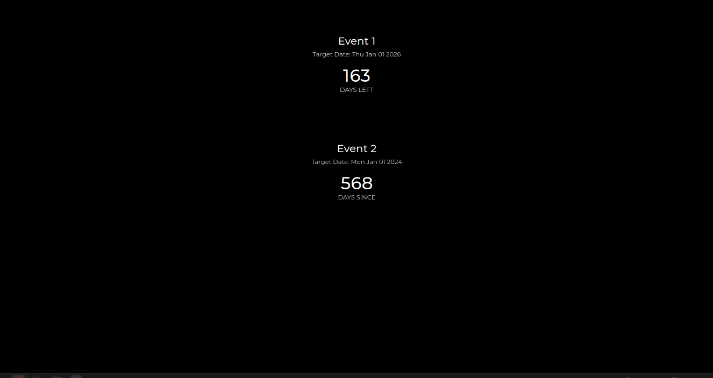
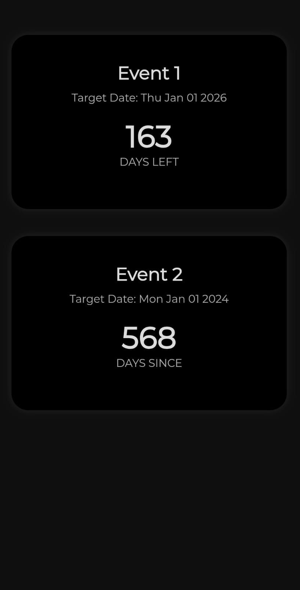

# Multi-Event Countdown

A minimalist, mobile-friendly countdown timer for tracking multiple events.  
Built with just HTML, CSS, and JavaScript — no libraries or frameworks required.




## 🌟 Features

- Supports multiple events
- Shows days left or days since
- Clean, responsive design
- Easy to customize
- Use custom fonts
- GitHub Pages ready

## ✍️ Customize Your Events

Edit the `events` array inside `Updated-countdown-stable.html`:

```js
const events = [
  { name: "Event1", endDate: makeDate(1, 1, 2026) },
  { name: "Event2", endDate: makeDate(1, 1, 2023) }
];
